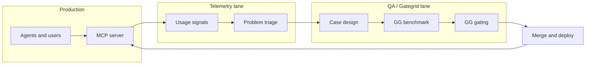

# Product Roadmap

Official priorities for fast-mcp-telegram. Capability facts live in [Strategic-Market-Positioning.md](Strategic-Market-Positioning.md). Third-party Gemini research is under [research/](research/).

Last updated: 2026-05-27.

## North star

**Shared `http-auth` multi-user hosting** — one gateway, many Bearer tokens, one Telegram account per token. Optimize tenant isolation, blast-radius control, stability, and agent correctness.

## Roadmap lanes

Work is organized in parallel **lanes**. Each lane has its own branch until merge-ready.

| Lane | Branch | Purpose |
| --- | --- | --- |
| **Trust** | `feature/acl` | Agent guardrails per Bearer token (lanes/profiles), not account lockdown — see [ADR 0001](adr/0001-agent-scoped-session-acl.md) |
| **Telemetry** | `feature/telemetry` *(planned)* | Production signals that tell QA where agents and users struggle |
| **QA / Gategrid** | `feature/evals` | Benchmark tool behavior with [Gategrid](https://github.com/leshchenko1979/gategrid) — **GG** — and enforce regressions via **GG gating** |
| **Docs / strategy** | `master` | Roadmap, capability index, Gemini research reference |

### QA loop: telemetry → benchmark → gate

Telemetry and Gategrid serve different steps of the same **QA function**. Telemetry observes real usage; Gategrid proves fixes and blocks regressions.

| Step | Lane | What happens |
| --- | --- | --- |
| **1. Observe** | Telemetry | Collect structured signals from production: tool errors, `FLOOD_WAIT`, latency outliers, auth failures, repeated tool-selection mistakes. Surfaces *where* quality breaks in the wild. |
| **2. Decide** | QA | Turn telemetry findings into hypotheses and **GG case** candidates — new prompts, matrices, or baseline updates. Prioritize cases that match real failure modes. |
| **3. Benchmark** | QA / Gategrid | Run **GG** matrices (`smoke`, `gate`, optional live model) to measure pass rate, tool choice, and regressions vs baselines. Informs whether a tool or doc change actually helps agents. |
| **4. Assure** | QA / Gategrid | **GG gating** on PRs: `gategrid gate` against [evals/ci/baselines/main.json](../evals/ci/baselines/main.json) blocks merges when pass rate or like-for-like cells regress. |
| **5. Ship** | All lanes | Merge when trust, telemetry hooks, and gate are aligned for the change scope. |

**Today:** step 3–4 are scaffolded on `feature/evals`. Step 1–2 are planned on `feature/telemetry` (no implementation on `master` yet).

## Branches

| Branch | Lane | Contents |
| --- | --- | --- |
| `master` | Docs / strategy | [Roadmap.md](Roadmap.md), [Strategic-Market-Positioning.md](Strategic-Market-Positioning.md), Gemini [research/](research/) |
| `feature/acl` | Trust | Session ACL implementation and design docs |
| `feature/evals` | QA / Gategrid | [evals/](../evals/), [gategrid-eval.yml](../.github/workflows/gategrid-eval.yml) |
| `feature/telemetry` | Telemetry | *Planned* — production observability for QA triage |

## Decisions (2026-05-26)

| Topic | Decision |
| --- | --- |
| ACL | Opt-in via `ACL_ENABLED`; per-token rules in static file — `feature/acl` |
| QA model | Telemetry informs case design; **GG benchmark** validates; **GG gating** enforces on PR |
| Evals | Gategrid harness on `feature/evals`; not merged until gate is stable |
| Telemetry | Separate lane; must feed QA triage before cases are added blindly |
| Post-ACL focus | Telemetry spike + eval expansion before rate limits / SQLite |

## Current sequence

| Step | Status | Lane | Branch | Deliverable |
| --- | --- | --- | --- | --- |
| 1. Roadmap and research | Done | Docs | `master` | This doc, Gemini under [research/](research/) |
| 2. ACL audit and design | Done | Trust | `feature/acl` | [acl-operator-research.md](research/acl-operator-research.md), [acl-design-brief.md](research/acl-design-brief.md) |
| 3. ACL MVP | Done | Trust | `feature/acl` | [session_acl.py](../src/server_components/session_acl.py) |
| 4. Principal identifier forms | Planned | Trust | `feature/acl` | Human-readable `principals:` keys: `@username`, `user_id`, or opaque id — see [Trust lane](#trust-lane--planned-scope) |
| 5. GG scaffold | In progress | QA | `feature/evals` | Six gate cases, mock baseline, PR workflow |
| 6. Telemetry for QA | Planned | Telemetry | `feature/telemetry` | Tool/error/latency signals → case backlog |
| 7. GG depth + live eval | Planned | QA | `feature/evals` | Cases driven by telemetry; optional VDS live matrix |
| 8. Merge feature branches | Pending | — | — | PRs: `feature/acl`, `feature/telemetry`, `feature/evals` |

## Shipped on `master`

- [Strategic-Market-Positioning.md](Strategic-Market-Positioning.md) capability index
- Gemini research under [research/](research/) (third-party reference)
- Roadmap lane model (this document)

Trust, telemetry, and Gategrid evals merge from their feature branches when each lane is ready.

## Trust lane — planned scope

Operator-facing enhancements beyond ACL enforcement (not implemented):

| Item | Purpose |
| --- | --- |
| **Sensitive peer denylist (Phase 1.5)** | Operator-configured `blocked_peers` denylist for **all** tokens when non-empty — independent of `chats` allowlist. Dual pre/post enforcement; recommended defaults in `acl.yaml.example` + SECURITY.md. See [ADR 0001](adr/0001-agent-scoped-session-acl.md), [acl-design-brief.md](research/acl-design-brief.md). |
| **Chat metadata registry** | Operator-curated metadata for whitelisted/shared chats so team agents can navigate `find_chats` results — human titles, descriptions, tags, and “look here for X” hints. Complements ACL **workspace lanes** (which chats a token may use) with **navigation hints** (what each chat is for); does not replace lane allowlists. Likely config alongside `acl.yaml` or a sibling file; enrichment at the tool boundary (e.g. post-filter on `find_chats`). |
| **Principal identifier forms** | **Admin ergonomics:** operators can key `principals:` entries by Telegram `@username` or numeric `user_id` instead of copying opaque Bearer strings — easier to assign lanes to people and audit who has which profile. **Semantics:** these are **alternative principal identifiers** for the same lane rules; they identify the **Telegram account** bound to a session (`{id}.session`), not chat peers listed under `chats:`. **Runtime unchanged:** HTTP clients still send `Authorization: Bearer <token>`; the server resolves identifiers to the matching session at config load or setup time. |
| **ACL chat ref resolution** | Resolve `@username` lane entries against numeric peer ids in tool args and list results (entity lookup), so operators need not duplicate id and handle in `chats`. |

See [acl-design-brief.md](research/acl-design-brief.md) Phase 1.5 and Phase 3 for related ACL work.

## Telemetry lane — planned scope

Candidate signals for QA triage (not implemented):

| Signal | QA use |
| --- | --- |
| Tool error rate by tool name | New or tightened GG cases for that tool |
| `FLOOD_WAIT` / connection errors | Rate-limit and caching decisions; stress cases |
| P95 tool latency | Performance regressions; matrix timing budgets |
| Wrong-tool patterns | Case prompts that require disambiguation |
| Auth / ACL denials | Security docs and negative-path cases |

Implementation choices (OpenTelemetry, Logfire, structured logs → query) belong on `feature/telemetry`.

## QA / Gategrid lane — current scope

See [evals/README.md](../evals/README.md) on branch `feature/evals`.

| Artifact | Role in QA loop |
| --- | --- |
| [evals/cases/](../evals/cases/) | User-language prompts → **benchmark** scenarios |
| [evals/matrices/](../evals/matrices/) | `smoke` vs `gate` run profiles |
| [evals/ci/baselines/main.json](../evals/ci/baselines/main.json) | Regression baseline for **GG gating** |
| [.github/workflows/gategrid-eval.yml](../.github/workflows/gategrid-eval.yml) | PR mock gate + manual live dispatch |

## Backlog (not sequenced)

| Item | Lane | Notes |
| --- | --- | --- |
| Sensitive peer denylist | Trust | Phase 1.5 — operator `blocked_peers` list + dual enforcement; see Trust lane planned scope |
| Principal identifier forms | Trust | Human-readable principal identifiers (`@username`, `user_id`) as alternatives to opaque ids — see [step 4](#current-sequence) and Trust lane |
| Per-token rate limits | Trust / ops | Complements telemetry FLOOD_WAIT signals |
| SQLite read cache | Performance | Pairs with ACL whitelists |
| ACL v2 permission matrix | Trust | Prgebish-style read/send per chat |
| Prompt-injection scanner | Trust | After ACL + QA coverage |
| OAuth2 / IdP | Enterprise | Federation path |
| **External session storage** (PostgreSQL / Redis) | Infrastructure | Persistent Telethon sessions for ephemeral deployments (Smithery hosted). Options: PostgreSQL-backed session store or Redis-based StringSession cache. Unblocks userbot scenarios in hosted Docker environments. See [research/session-storage-design.md](research/session-storage-design.md) |
| Stdio path sandbox | Trust | Local stdio users |
| Multi-replica attachment tickets | Ops | Shared ticket store |
| Media OCR pipeline | Features | Beyond voice transcription |
| **Refactoring** | All lanes | Post-Phase-3 cleanup: consolidate session config, extract shared logic from `connection.py`/`server.py`, reduce duplication across transport modes, standardise error types. Unblocks faster iteration in subsequent phases. |
| **Docs review** | Docs / strategy | Post-Phase-3 audit: verify every public function has a docstring, every tool has usage examples, every ADR is up to date with code, all `TODO`s are intentional. Publish API reference. |

## Where to record future work

| Kind of item | Where to write it |
| --- | --- |
| Prioritized capability, lane, or backlog item | **This doc** — lane sections (`Trust`, `Telemetry`, `QA`) or [Backlog](#backlog-not-sequenced) |
| Design detail for an approved lane (phases, enforcement, config shape) | `docs/research/*-design-brief.md` (e.g. [acl-design-brief.md](research/acl-design-brief.md)) |
| Architectural decision with tradeoffs and consequences | `docs/adr/NNNN-*.md` (new ADR when the decision is settled) |
| Competitor notes, spikes, third-party research | `docs/research/` (reference only; link from Roadmap) |
| Current sprint focus and immediate next steps | `.cursor/memory-bank/activeContext.md` (3–5 items; not a substitute for Roadmap) |

**Rule of thumb:** Roadmap names *what* and *which lane*; research briefs spell *how*; ADRs record *why* a direction was chosen.

## References

- [Strategic-Market-Positioning.md](Strategic-Market-Positioning.md)
- [research/gemini-roadmap-proposal.md](research/gemini-roadmap-proposal.md)
- [Installation.md](Installation.md)
- [Gategrid](https://github.com/leshchenko1979/gategrid) — external eval and gating harness
